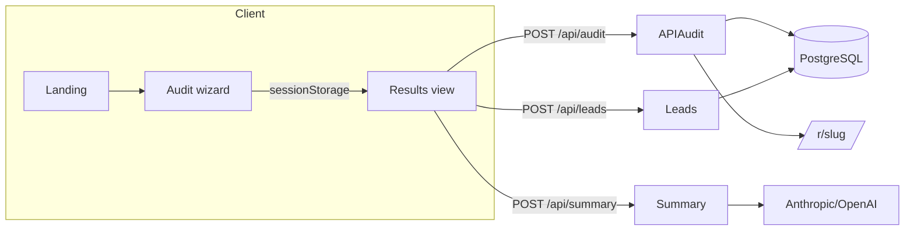

# Architecture

## High-level request flow

### Audit engine boundaries

- **Pricing dataset** (`src/data/pricing.json`) loads through Zod (`src/lib/pricing/types.ts`).
- **Bench math** (`src/lib/audit-engine/bench.ts`) knows how to translate SKUs → modeled USD.
- **Rules** (`src/lib/audit-engine/engine.ts`) emit transparent reasoning strings (no LLM involved).

This separation lets data analysts bump pricing versions without touching recommendation logic.

## Persistence model (Prisma)

`Audit` stores immutable inputs + deterministic outputs. `AuditTool` retains line-item reasoning for CRM sync. `PublicReport` duplicates a **sanitized JSON payload** so public routes never accidentally leak lead rows. `AnalyticsEvent` captures lightweight funnel telemetry alongside optional PostHog browser events.

## Share & SEO surfaces

- Metadata + canonical URLs defined in `src/app/layout.tsx` + route-level overrides (`src/app/r/[slug]/page.tsx`).
- Dynamic OG image implemented via `src/app/r/[slug]/opengraph-image.tsx` using `@vercel/og` primitives (`next/og`).

## Abuse protection & rate limiting

| Layer | Implementation | Why |
| --- | --- | --- |
| Honeypot | Hidden `website` field on lead form | Zero UX cost; catches naive bots |
| Redis sliding window | `@upstash/ratelimit` keyed by hashed IP | Stateless Node/Vercel friendly |
| Soft-disable | When Redis env vars absent, limits noop | Dev velocity; documented risk |

**Trade-off:** Without Redis, horizontally scaled regions each maintain separate counters — acceptable for MVP, not for high-risk endpoints long term.

**Optional hCaptcha:** Adds friction (~5–10% drop-off) but kills scripted funnels; recommended once leads/day > few hundred.

## AI executive summary path

LLMs run **after** deterministic savings are computed. Prompt construction lives in `src/lib/ai/summary.ts` with exponential backoff retries and deterministic fallback copy — UX never blocks on vendor latency.

## Scaling toward ~10k audits/day

1. **Write path:** Move `POST /api/audit` to an enqueue pattern (SQS / QStash) + worker fleet for Prisma writes; API returns `202` + `auditJobId`.
2. **Read path:** Cache `PublicReport` payloads at the edge (KV / CDN) keyed by slug; invalidate on rewrite.
3. **Database:** Partition `AnalyticsEvent` monthly or ship to ClickHouse/BigQuery for OLAP.
4. **OG images:** Pre-render top reports or cache `ImageResponse` output in object storage.

## CI/CD

GitHub Actions workflow (`.github/workflows/ci.yml`) provisions Postgres service container, runs lint → typecheck → tests → build mirroring Vercel assumptions.
